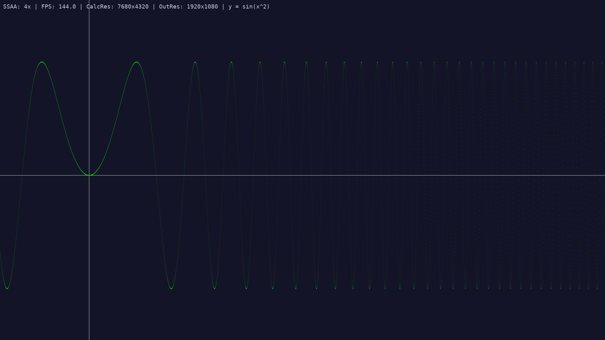

# HIP Graphing Calculator

A simple, fullscreen graphing calculator implemented using HIP for AMD GPU acceleration and SDL2/SDL_ttf for display and text rendering.

This project was generated by **Google Gemini 2.5 Pro (one-shot)** in response to user prompts, primarily for **educational purposes** to demonstrate GPU computing concepts with HIP, dynamic resource management, and basic rendering techniques like SSAA.

## Screenshot


*(Showing y = sin(x^2) at 4x SSAA)*

## Features

*   GPU-accelerated rendering using AMD HIP.
*   Fullscreen display using SDL2.
*   Multiple preset mathematical functions (switchable with arrow keys).
*   Interactive panning (mouse drag) and zooming (mouse wheel).
*   Dynamic Supersampling Anti-Aliasing (SSAA) with adjustable quality levels (1x, 2x, 4x - controlled by arrow keys).
*   On-screen display showing:
    *   Current SSAA level
    *   Frames Per Second (FPS)
    *   GPU Calculation Resolution (supersampled)
    *   Output Resolution (screen)
    *   Current Function Name
*   Pixel-perfect rendering relative to the chosen SSAA level.

## Prerequisites

*   An AMD GPU compatible with ROCm/HIP.
*   ROCm/HIP SDK installed (including the `hipcc` compiler).
*   SDL2 development library (`libsdl2-dev` on Debian/Ubuntu, `SDL2-devel` on Fedora).
*   SDL2_ttf development library (`libsdl2-ttf-dev` on Debian/Ubuntu, `SDL2_ttf-devel` on Fedora).
*   A TrueType Font (TTF) file (e.g., `DejaVuSansMono.ttf`). Place this in the same directory as the executable, or modify the `FONT_PATH` constant in the source code.

## Build Instructions

1.  Save the C++ code (e.g., as `graph_calc.hip.cpp`).
2.  Make sure the required development libraries are installed.
3.  Compile using `hipcc`:

    ```bash
    hipcc graph_calc.hip.cpp -o graph_calc -lSDL2 -lSDL2_ttf -lm --std=c++11
    ```

    *   `-o graph_calc`: Specifies the output executable name.
    *   `-lSDL2`, `-lSDL2_ttf`: Links the necessary SDL libraries.
    *   `-lm`: Links the standard math library.
    *   `--std=c++11`: Enables C++11 features used in the code.

## Usage

1.  Ensure the executable (`graph_calc`), the font file (e.g., `DejaVuSansMono.ttf`), and the screenshot (`screenshot.png`, if you want it alongside the README) are in the same directory.
2.  Run the executable from the terminal:

    ```bash
    ./graph_calc
    ```

### Controls

*   **Mouse Drag (Left Button)**: Pan the graph view.
*   **Mouse Wheel Scroll**: Zoom in/out (centered on the cursor).
*   **Left/Right Arrow Keys**: Cycle through the preset graph functions.
*   **Up/Down Arrow Keys**: Increase/Decrease the Supersampling (SSAA) factor (1x, 2x, 4x).
*   **R Key**: Reset the view (pan/zoom) to the default for the current graph preset.
*   **Escape Key**: Quit the application.
